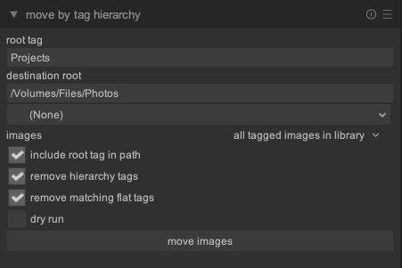

# darktable-scripts

Lua modules for [darktable](https://www.darktable.org/).

## move_by_tag_hierarchy

Moves every image carrying a hierarchical tag into a folder tree that mirrors
the tag tree, then optionally detaches the tags that the path now expresses.



*The module in the lighttable right panel. The settings shown are one
configuration, not the defaults — see [Usage](#usage).*

An image tagged `Places|UK|London` is moved to:

| include root tag in path | destination |
| --- | --- |
| on | `<destination root>/Places/UK/London/` |
| off | `<destination root>/UK/London/` |

An image tagged only with the root tag lands in the destination root itself
(or in `<destination root>/Places`).

### Requirements

darktable with Lua API 7.0.0 or newer. Developed and tested against darktable
5.6 on macOS. No external software.

### Installation

Copy the script into darktable's config directory and require it:

```bash
cp move_by_tag_hierarchy.lua ~/.config/darktable/lua/
echo 'require "move_by_tag_hierarchy"' >> ~/.config/darktable/luarc
```

Or install it with `script_manager`. Either way, restart darktable — the module
uses `destroy_method = "hide"`, so script_manager does not re-execute the file
and a reload from the module list will not pick up a changed script.

**move by tag hierarchy** then appears in the lighttable right panel. It may be
collapsed; click the header to open it.

### Usage

1. **root tag** — the tag to process, e.g. `Places`. Every image tagged with it
   or with anything below it (`Places|UK|London`) is a candidate.
2. **destination root** — the top of the folder tree, e.g.
   `/Volumes/Photos/Sorted`. The button below the field opens a directory
   chooser.
3. **images** — process every tagged image in the library, or only the selected
   ones.
4. **include root tag in path** — see the table above.
5. **remove hierarchy tags** — after a verified move, detach the root tag and
   every tag below it that the image carries.
6. **remove matching flat tags** — additionally detach non-hierarchical tags
   whose name exactly matches a path component, e.g. a plain `London` tag on an
   image moved to `.../UK/London`. Off by default: a flat tag can share a name
   with a place by accident (`nice`, `bath`), and detaching a tag cannot be
   undone.
7. **dry run** — report what would happen without moving anything or changing
   tags. On by default.

The status line reports
`moved N, N already in place, N skipped, N failed, N tags removed`. The
per-image detail always goes to the darktable log; start darktable with
`-d lua` to see it on the console.

The run is cancellable from the progress bar. Each image is committed
individually, so stopping partway leaves the already-moved images done and the
rest untouched.

### Which tag decides the destination

The deepest matching tag wins. An image tagged both `Places|UK` and
`Places|UK|London` goes to `.../UK/London`, because the first is an ancestor of
the second. An image tagged `Places|UK` and `Places|France` is skipped — those
disagree about where it should go.

Tag components are sanitized for use as directory names: `<>:"/\|?*`, control
characters, and trailing dots and spaces are replaced or trimmed.

### What is skipped

- tags pointing at two different destinations
- another file, **or an orphaned XMP sidecar**, already at the target path
- the image's file is missing on disk
- duplicates sharing one file on disk that want different destinations — the
  file is left alone rather than moved under one duplicate's tags

Skips and failures are counted separately: a skip means the image was left
alone deliberately, a failure means something went wrong (`mkdir` failed, no
film roll could be created, or darktable raised while moving). Both are logged
with a reason.

### Notes

- Tags are detached only after the move has been verified, so a failed move
  never leaves an image stripped of the tags that describe where it belongs.
- darktable moves the XMP sidecar along with the image.
- On macOS and Windows, paths that differ only in case name the same directory.
  The module accounts for this: a destination differing only in case from an
  existing film roll reuses that film roll instead of creating a second one for
  the same directory.
- `darktable`'s own internal tags are never processed or detached.
- Settings persist between sessions in `darktablerc` under
  `lua/move_by_tag_hierarchy/`.

### A word of caution

This module moves files on disk. Run it with **dry run** on first and read the
log before committing to a real run, and make sure you have a backup of both
your photos and `~/.config/darktable/library.db`.

## prune_flat_tags

Removes flat (non-hierarchical) tags whose name a hierarchical tag already
carries. A plain `London` tag says nothing that `Places|UK|London` does not.

Where `move_by_tag_hierarchy`'s **remove matching flat tags** option cleans up
the images it moves, this module works on the tag list itself, across the whole
library, without touching a single file.

### Requirements

darktable with Lua API 7.0.0 or newer. Developed and tested against darktable
5.6 on macOS. No external software.

### Installation

```bash
cp prune_flat_tags.lua ~/.config/darktable/lua/
echo 'require "prune_flat_tags"' >> ~/.config/darktable/luarc
```

Or install it with `script_manager`, then restart darktable. **prune flat
tags** appears in the lighttable right panel.

### Usage

1. **match** — what counts as a match. With *any level of a hierarchy* the flat
   tag `UK` matches `Places|UK|London`; with *leaf level only*, only `London`
   does.
2. **ignore case** — off by default, because darktable's tags are case
   sensitive: `london` and `London` are two different tags.
3. **action** — what happens to a matching flat tag:

   | action | effect |
   | --- | --- |
   | detach where the hierarchy tag is present | detaches the flat tag only from images that already carry a hierarchical tag containing the name; deletes the tag once no image is left carrying it |
   | delete the tag from the library | deletes the flat tag outright, detaching it from every image, including images with no hierarchical tag saying the same thing |

4. **dry run** — report what would happen without changing any tag. On by
   default.

The status line reports
`deleted N tags, kept N, N detachments, N refused, N skipped, N failed`.
*Refused* tags were rejected while planning, *skipped* ones while running. The
detail always goes to the darktable log — including a line naming every single
image that loses a tag, since a detachment cannot be undone. Start darktable
with `-d lua` to see it on the console.

The reported detachment count is read back from the library (the drop in the
tag's image count), not from the number of calls made. A call that reports
success while changing nothing therefore shows up as `0 detachments` and a
failure, which is the behaviour that made the first version of this module
misreport a run entirely.

The run is cancellable from the progress bar, during the scan as well as during
the pruning. Each tag is committed individually, so stopping partway leaves the
tags already handled done and the rest untouched.

### Which is the right action

*detach where the hierarchy tag is present* is the safe one and the default.
Consider two images: one tagged `Places|UK|London` **and** `London`, one tagged
only `London`. The first is genuinely redundant; the second is the only record
that the image has anything to do with London. Detaching keeps that record and
reports the tag as kept, so it shows up in the log rather than disappearing
silently.

Choose *delete the tag from the library* when the flat tags are known leftovers
— an import from software that had no tag hierarchy, say — and the hierarchy is
now the only version you want to keep.

### Every tag is verified by name before it is touched

Walking `dt.tags` is not sufficient to identify a flat tag. The walk has been
observed mid-session to yield entries named for a single level of a hierarchy —
`Grass` for `Subjects|Outdoors|Nature|Landscape|Grass` — which report that
hierarchy's images and accept `detach` and `delete` calls without changing
anything in the database. At darktable startup the same walk returns full
paths, so the behaviour is not stable across a session.

The module therefore treats the walk as a source of *names only*, and requires
two independent things to agree before touching anything:

1. the name must round-trip through `dt.tags.find()` and come back as a tag
   with the identical name, and
2. at least one of that tag's images must report carrying a tag of that exact
   name when asked directly, via `dt.tags.get_tags()`.

The second condition is what makes the first meaningful. `find()` returning an
object is only `find()`'s word; an image reports a hierarchy as
`Subjects|Outdoors|Nature|Landscape|Grass`, never as a bare `Grass`, so an
entry named for a hierarchy level cannot be corroborated and is refused. Both
modes check this — delete mode has no other evidence at all about the tag it is
about to remove.

Anything refused is logged as `REFUSED` with its reason and counted in the
status line. Tags are resolved again at execution time rather than trusting
objects captured while planning, and a delete only follows a detachment that
has been verified against the library.

A consequence worth knowing: a flat tag attached to **no** images cannot be
corroborated either, so it is refused rather than deleted. darktable's own
`delete_unused_tags` script is the right tool for those.

### Notes

- In *delete the tag from the library* mode the tag is removed in one
  operation, which detaches it from every image by itself. It is not detached
  image by image first: that would only add ways for a run to stop half done.
- **ignore case** is byte-wise, so it does not equate `café` with `CAFÉ`, and
  it does not see decomposed and precomposed accents (NFD vs NFC) as the same
  name — realistic on macOS. Both are false negatives: such tags are left
  alone rather than wrongly pruned.
- `darktable`'s own internal tags (`darktable|...`) are ignored on both sides:
  they are never pruned, and they never make a flat tag a match — a flat `jpeg`
  tag is not matched by `darktable|format|jpeg`.
- Everything is resolved before anything is changed, because detaching or
  deleting a tag mutates the tag list being walked.
- A tag that fails partway (an image that vanished from the library, say) is
  counted as failed and left in place rather than half-pruned; the run
  continues with the next tag.
- Settings persist between sessions in `darktablerc` under
  `lua/prune_flat_tags/`.

### A word of caution

Detaching and deleting tags cannot be undone from Lua. Run it with **dry run**
on first and read the log, and back up `~/.config/darktable/library.db`.

## select_grouped

Adds **select grouped** and **select ungrouped** to the *select* module in the
lighttable right panel.

darktable's collect and filter modules only offer a fixed set of criteria, and
group membership is not one of them — it cannot be added from Lua. This is the
next best thing: **select grouped** selects the images of the current
collection that share a group with at least one other image, and **select
ungrouped** selects the rest. From there the *selected image[s]* module's
**group** / **ungroup** buttons act on what you found.

### Requirements

darktable with Lua API 7.0.0 or newer. Developed and tested against darktable
5.6 on macOS. No external software.

### Installation

```bash
cp select_grouped.lua ~/.config/darktable/lua/
echo 'require "select_grouped"' >> ~/.config/darktable/luarc
```

Or install it with `script_manager`, then restart darktable.

### Notes

- Grouping is a property of the library, not of the collection. An image whose
  only group partner sits in another film roll still counts as grouped.
- darktable puts every image in a group, so an image on its own is a group of
  one. "Grouped" therefore means the group has a second member, not that the
  image has a group at all — which is why the two buttons together do not
  simply select everything twice.
- Both buttons ask the database for each image's group, so a large collection
  takes a moment. The run is cancellable from the progress bar; cancelling
  applies the partial selection and says so in the message.
- Each button is also available as a shortcut, under *lua/select grouped* and
  *lua/select ungrouped* in the shortcuts dialog. The shortcuts act on the
  whole current collection.

## License

GNU Lesser General Public License, version 2.1 or later. See [LICENSE](LICENSE).
